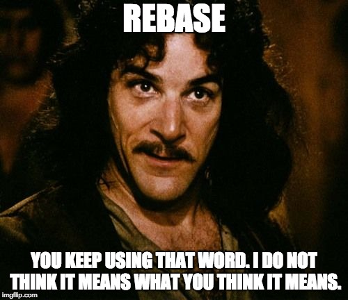

@title[git]


---
@title[What is git?]

### What is git?

#### The Basics


+++
@title[git basics]

```bash
git help
git init
git clone
git status
git show
git log
git branch
git checkout
git commit
git add
git rm
git mv
git reset
git revert
git diff
git merge
git rebase ECHO more on this later
git tag
git fetch
git remote
git pull
git push
git stash
git cherry-pick
```

@[1]
@[2]
@[3]
@[4]
@[5]
@[6]
@[7]
@[8]
@[9]
@[10]
@[11]
@[12]
@[13]
@[14]
@[15]
@[16]
@[17]
@[18]
@[19]
@[20]
@[21]
@[22]
@[23]
@[24]

#### Everything in git is a file.

---
@title[Subcommands]
### Subcommands


---
@title[Git lifecycle]
### Git lifecycle


---
@title[Git local operations]
### Git local operations


---
@title[Git remote operations]
### Git remote operations


---
### Github Flow


+++
@title[Github Flow]


---
@title[DEMO]
### DEMO

---
@title[A Word About Rebase]
### A Word About Rebase


---
@title[Questions?]
### Questions?

---
#### DO

  * DO keep master in working order
  * DO pull in changes
  * DO tag releases
  * DO push feature branches for discussion
  * DO learn when to use rebase (HINT: interactive merge conflicts and clean history)

---
#### DON’T

  * DON'T merge in broken code.
  * DON'T commit onto master directly.
  * DON'T hotfix onto master! Use a feature branch.
  * DON'T rebase master.
  * DON'T merge with conflicts. Handle conflicts upon rebasing.

---
### Resources
#### [Atlassian git tutorials](https://www.atlassian.com/git/tutorials)
#### [Github git handbook](https://guides.github.com/introduction/git-handbook)
#### [Atlassian git tutorials](https://www.atlassian.com/git/tutorials)
#### [Learn git branching](https://learngitbranching.js.org/)
#### [Github - learning git](https://try.github.io/)
